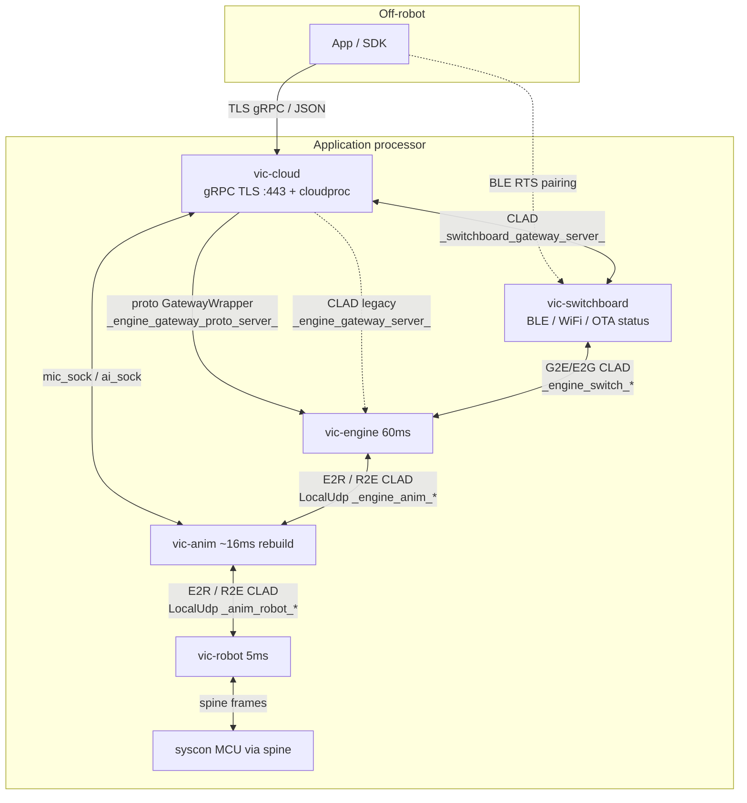

# Process IPC map

**Path:** `docs/mapping/PROCESS-IPC.md`  
**Mapped:** 2026-07-28   **Confidence:** high  
**Upstream:** `docs/architecture/arch_overview.md` §Interprocess comms  
**Related:** [`HIGH-LEVEL.md`](HIGH-LEVEL.md), [`clad/README.md`](../../clad/README.md), [`engine/comms/README.md`](../../engine/comms/README.md), [`engine/externalInterface/README.md`](../../engine/externalInterface/README.md), [`cloud/README.mapping.md`](../../cloud/README.mapping.md), [`robot/README.mapping.md`](../../robot/README.mapping.md), [`animProcess/README.md`](../../animProcess/README.md), [`platform/README.md`](../../platform/README.md)

---

## What this is

How on-robot processes exchange messages: **CLAD unions** on the engine–anim–robot triangle, **protobuf** (preferred) + legacy CLAD between `vic-cloud` and engine, and **switchboard** BLE/WiFi control paths. All in-process links observed here use **Unix-domain sockets** (datagram-style `LocalUdp*` / unixgram), not TCP between engine/anim/robot.

---

## 1. CLAD message families

From `arch_overview.md` §Messages and defs under `robot/clad/` + `clad/src/`:

| Abbr | CLAD definition | Direction (logical) | Who packs / unpacks |
|---|---|---|---|
| **E2R** | `robot/clad/src/clad/robotInterface/messageEngineToRobot.clad` | Engine→Anim, Engine→Robot, Anim→Robot | Engine full C++; robot + anim **C++-lite** |
| **R2E** | `…/messageRobotToEngine.clad` | Robot→Anim, Robot→Engine | Same split |
| **A2E** | `…/messageFromAnimProcess.clad` (included into R2E union) | Anim→Engine (anim-origin tags on the robot-interface bus) | Anim handlers + engine subscribers |
| **E2G** | `clad/src/clad/externalInterface/messageEngineToGame.clad` | Engine→UI/App/SDK (“game” = historical Cozmo name) | Engine `UiMessageHandler` |
| **G2E** | `…/messageGameToEngine.clad` | UI/App/SDK→Engine | Same |
| Viz | `clad/vizSrc/clad/vizInterface/messageViz.clad` | Engine→Viz | Debug / Webots path |

Also (gateway / cloud, not the 3-way robot bus):

- `clad/src/clad/gateway/` — external robot APIs + `switchboard.clad`
- `clad/src/clad/cloud/` — token / mic / jdocs-oriented CLAD used by Go cloud + mic path

**Broadcast/subscribe:** Inside engine, E2G and G2E are both delivered to external sockets **and** rebroadcast so other engine subsystems can `Subscribe` (`arch_overview` §Broadcast / Subscribe; `engine/externalInterface/README.md`).

---

## 2. Transport layer

| Link | Mechanism | Socket basenames (`coretech/messaging/shared/socketConstants.h`) |
|---|---|---|
| Engine ↔ Anim | `LocalUdpClient` (engine) ↔ `LocalUdpServer` (anim) | `_engine_anim_client_` / `_engine_anim_server_` + robotID |
| Anim ↔ Robot | `LocalUdpClient` (anim) ↔ server on robot | `_anim_robot_client_` / `_anim_robot_server_` + robotID |
| Engine ↔ Switchboard | `LocalUdpSocketComms` server on engine | `_engine_switch_server_` / `_engine_switch_client_` |
| Engine ↔ Cloud (CLAD legacy) | domain socket server on engine | `_engine_gateway_server_` |
| Engine ↔ Cloud (proto preferred) | same pattern | `_engine_gateway_proto_server_` |
| Cloud ↔ Switchboard | domain socket | `_switchboard_gateway_server_` |
| Mic / AI (anim ↔ cloud) | unixgram basenames | `mic_sock`, `ai_sock` |
| Token / jdocs (cloud-internal + peers) | domain sockets | `token_server`, `jdocs_server`, … |

**Path root:** on-robot `LOCAL_SOCKET_PATH` = `/dev/socket/`; simulator `SIMULATOR` → `/tmp/` (`socketConstants.h`).

**Packet style:** UDP-like datagrams over AF_UNIX. Max packet buffers commonly **2048** bytes (engine `robotConnectionManager.cpp`, anim `animProcessMessages.cpp`). Robot CLAD cpp-lite generation uses max message size **1400** (`robot/README.mapping.md`).

**Reliable transport:** Upstream `arch_overview` states that only engine↔anim historically used `lib/util/…/transport` **reliable transport** (Cozmo holdover), and that general reliability work remained incomplete. In **this tree’s primary eng↔anim path**, engine connects with plain `LocalUdpClient` to anim’s `LocalUdpServer` (`engine/comms/robotConnectionManager.cpp` `Connect` → `ENGINE_ANIM_*`; `animProcess/…/animComms.cpp` `InitEngineComms` / `InitRobotComms`). `MessageHandler::SendMessage` still takes `reliable`/`hot` parameters but packs CLAD and calls `SendData` on that UDP client (`engine/robotInterface/messageHandler.cpp` ~L137–167). The reliable-transport library remains under `lib/util` (e.g. networkApp test harness) — treat “reliable eng↔anim” as **documented intent / holdover**, not necessarily a separate session layer on the current LocalUdp path. [INFERRED for unused `reliable` flag]

---

## 3. Anim as relay (engine ↔ robot)

**Do not assume a direct engine↔robot command socket for ordered traffic.** Messages go **engine ↔ anim ↔ robot** so order/sync stay coherent for both ends (`arch_overview` §Animation “Relaying messages”; `HIGH-LEVEL.md`).

| Piece | Role |
|---|---|
| `animProcess/src/cozmoAnim/animComms.{h,cpp}` | Low-level sockets: server for engine, client to robot |
| `animProcess/src/cozmoAnim/animProcessMessages.{h,cpp}` | CLAD unpack, anim-local handlers, forward/shuttle |
| Engine `RobotConnectionManager` | Connects to **anim** server path (`ENGINE_ANIM_*`), not robot |
| Engine `RobotInterface::MessageHandler` | Packs E2R / drains R2E for `RobotManager` |

**Per anim tick** (`AnimProcessMessages::Update`):

1. Drain engine packets → `EngineToRobot` → `ProcessMessageFromEngine`
2. Drain robot packets → `RobotToEngine` → `ProcessMessageFromRobot` (+ procedural audio)
3. Outbound: `SendAnimToRobot` / `SendAnimToEngine` → `AnimComms::SendPacketTo*`

**Forward policy (engine → robot):** Many E2R tags are handled only in anim (e.g. backpack lights, some calm-power / face-screen cases); others set `forwardToRobot = true` and are resent raw to the robot socket. Default branch forwards (`animProcessMessages.cpp` `ProcessMessageFromEngine` ~L673–711, including switch `.def` include for tag ranges).

**Robot → engine:** After anim-side side effects (e.g. `RobotState` timeout bookkeeping, mic payload to `MicDataSystem`), `ProcessMessageFromRobot` typically `SendAnimToEngine(msg)` (~L756–824).

Header comment: *“Shuttles messages between engine and robot processes”* (`animProcessMessages.h`).

---

## 4. Engine ↔ cloud

`vic-cloud` (Go) is the TLS gRPC / grpc-gateway face for app/SDK and runs cloudproc (voice, token, jdocs). See `cloud/README.mapping.md`.

| Path | Format | Server name | Engine handler |
|---|---|---|---|
| Preferred | **Protobuf** `GatewayWrapper` | `_engine_gateway_proto_server_` | `ProtoMessageHandler` (`engine/cozmoAPI/comms/protoMessageHandler.cpp` — `LocalUdpSocketComms(true, ENGINE_GATEWAY_PROTO_SERVER_PATH)`) |
| Legacy / deprecating | **CLAD** G2E/E2G-style | `_engine_gateway_server_` | `UiMessageHandler` + `EngineCladIpcManager` (`cloud/cloud/ipc_manager.go` comments) |

Cloud side: `cloud/cloud/ipc_manager.go` — `EngineProtoIpcManager` / `EngineCladIpcManager`; gateway acts as **client** to engine domain sockets. Write path comments point at `ProtoMessageHandler::ProcessMessages()`.

**Bridge inside engine:** `ProtoCladInterpreter` maps selected gateway protos into CLAD G2E (and some reverse) so legacy subscribers keep working (`engine/externalInterface/README.md`, `HIGH-LEVEL.md`).

**Mic / intents (not the gateway bus):** anim mic path uses `mic_sock` / `ai_sock` with cloud voice (`cloud/cloud/main.go`; socket basenames in `socketConstants.h`).

---

## 5. Switchboard relative to engine / cloud

**Process:** `vic-switchboard` (`platform/switchboard/switchboardd/`). Role: BLE pairing (RTS v2–v5), WiFi (connman/wpa), OTA status watch, and coordination with engine + gateway — **not** motor control or behavior policy.

| Peer | Socket | Messages | Code |
|---|---|---|---|
| Engine | `_engine_switch_server_` / `_engine_switch_client_` | E2G/G2E subset (pairing, WiFi scan/connect, BLE keys, …) | Engine: `UiMessageHandler` `UiConnectionType::Switchboard` → `LocalUdpSocketComms(..., ENGINE_SWITCH_SERVER_PATH)`; Switchboard: `engineMessagingClient.cpp` `Connect(ENGINE_SWITCH_CLIENT_PATH, ENGINE_SWITCH_SERVER_PATH)` |
| Cloud / gateway | `_switchboard_gateway_server_` | CLAD auth / external connection / BLE SDK proxy | `ipc_manager.go` `switchboardDomainSocket`; `switchboard_proxy.go` |

Upstream pairing docs: `docs/development/switchboard-pairing.md`, `switchboard-ble-api-v*.md`. Switchboard does **not** sit on the E2R/R2E anim relay path.

---

## 6. Diagram



ASCII (same topology):

```
  App/SDK --TLS gRPC--> vic-cloud --proto DS--> vic-engine
                 |              ^                |
                 |              | CLAD switch    | E2R/R2E
                 v              v                v
            vic-switchboard <------->      vic-anim
                 BLE/WiFi                    |
                                             | E2R/R2E
                                             v
                                        vic-robot --> syscon
```

---

## 7. Engine-side ownership (quick index)

| Concern | Primary code |
|---|---|
| Eng↔anim (as “robot process” link) | `engine/comms/robotConnectionManager.*`, `engine/robotInterface/messageHandler.*` |
| Tick: drain R2E then components | `docs/mapping/ENGINE-ROBOT-TICK.md` |
| Game CLAD sockets (switchboard + gateway CLAD) | `engine/cozmoAPI/comms/uiMessageHandler.*` |
| Gateway proto | `engine/cozmoAPI/comms/protoMessageHandler.*` |
| Abstract buses | `engine/externalInterface/` (`IExternalInterface`, `IGatewayInterface`) |
| Anim shuttle | `animProcess/…/animProcessMessages.*`, `animComms.*` |
| Cloud IPC | `cloud/cloud/ipc_manager.go`, `message_handler.go` |
| Socket name registry | `coretech/messaging/shared/socketConstants.h` |

---

## Open questions

- [UNKNOWN] Whether any remaining call path still constructs `ReliableTransport` for live eng↔anim (vs only LocalUdp observed on `RobotConnectionManager`).
- [UNKNOWN] Full switchboard CLAD tag set vs engine pairing handlers (platform L2).
- [UNKNOWN] Exact systemd ordering of `vic-robot` / `vic-anim` / `vic-engine` / `vic-cloud` / `vic-switchboard` socket readiness (service files partial in-tree).
